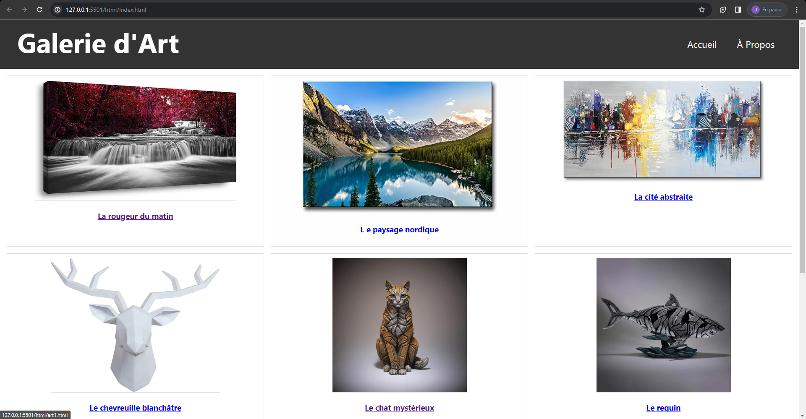

## Titre du projet (Galerie d'arts)

> Le site contient une page acceuil contenant des images d'arts pour pouvoir voir directement les oeuvres pour répondre le besoin des utilisateurs(que ce sois rapide) l'obectif visuel est la simplicité du site pour ne pas se perdre. Il y a pas vraiment de thème, les arts sont principalement des tableaux et des statues.
> Le but de ce projet est de développer une galerie d'art en ligne qui soit à la fois **responsive** et **interactive**. Vous utiliserez **HTML5** et **CSS3** pour créer une expérience utilisateur attrayante et accessible sur tous les appareils.

> Insérer une capture d'écran de votre site ici.
> 

## Critères d'Évaluation

| Critères                                              | Description                                                                                                                                                                | Poids |
| :---------------------------------------------------- | :------------------------------------------------------------------------------------------------------------------------------------------------------------------------- | :---- |
| **1. Respect du devis**                               | Conception du wireframe. Présence des éléments demandés.                                                                                                              | 15%   |
| **2. Qualité du Code**                                | Propreté et organisation du code. Commentaires explicatifs pour faciliter la compréhension. Utilisation correcte des balises HTML5 et des  propriétés CSS3. | 35%   |
| **3. Design et  Esthétique**                     | Créativité dans le design visuel de la galerie.  Cohérence et harmonie des couleurs, polices  et images.                                                         | 10%   |
| **5. Responsive  Design**                        | Adaptabilité du site sur différents appareils.  Utilisation efficace des media queries.                                                                               | 25%   |
| **6. Fonctionnalité et  Expérience Utilisateur** | Navigation facile et intuitive.                                                                                                                                            | 10%   |
| **8. Présentation**                                   | Clarté de la présentation orale du projet.                                                                                                                                 | 5%    |
